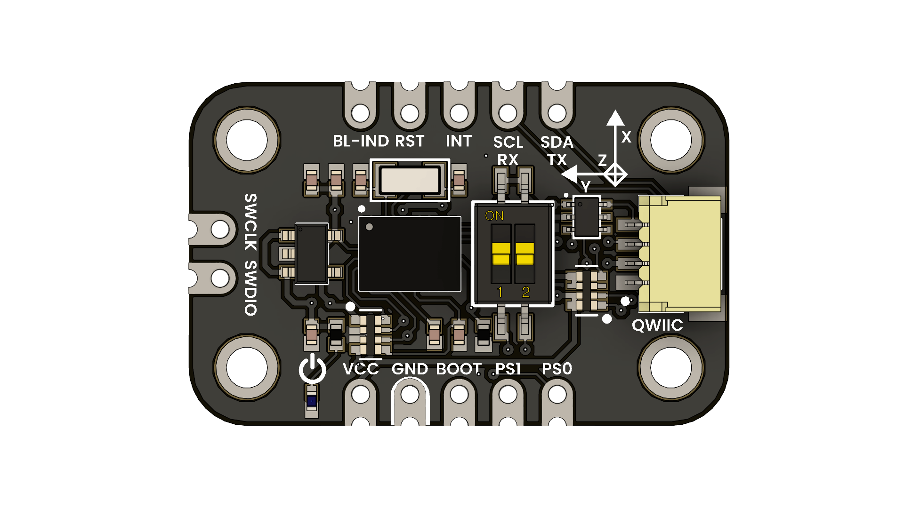

# DevLab: I2C BNO055 9-Axis Sensor

## Introduction
The **BNO055** is a 9-axis absolute orientation sensor from Bosch (`accelerometer` + `gyroscope` + `magnetometer`) with on-board sensor fusion. This breakout makes it easy to integrate, offering:
- A Qwiic-compatible connector for **I²C** at up to 400 kHz  
- Standard 2.54 mm header breakouts  
- A DIP-switch to select **I²C** or **UART** mode  
- SWD pads for programming/debugging  
- Boot indicator LED and pins for **RESET**, **BOOT** and **INT**  

  
  
UNIT BNO055 Module

## Additional Resources

| Resource | Link |
|:--------:|:----:|
| Wiki-UNIT Electronics | [Wiki - UNIT Electronics](https://unit-electronics-mx.github.io/wiki_uelectronics/es/docs/Sensors/bno055_/) |
| Github Repository | [Github Repository](https://github.com/UNIT-Electronics-MX/unit_bno055_module) |
| Product Brief | [Product brief](https://github.com/UNIT-Electronics-MX/unit_bno055_module/blob/main/docs/unit_bno055_module_product_brief.pdf) |

## Key Features

| Feature                 | Details                                                           |
|-------------------------|-------------------------------------------------------------------|
| **9-axis fusion**       | Accelerometer, gyro, magnetometer with internal fusion algorithms |
| **Output formats**      | Euler angles, quaternions, linear acceleration, raw sensor data   |
| **Accelerometer range** | ±2 g … ±16 g                                                      |
| **Gyroscope range**     | ±125 °/s … ±2000 °/s                                              |
| **Magnetometer range**  | ±1300 µT                                                          |
| **I²C interface**       | Up to 400 kHz                                                     |
| **UART interface**      | Up to 115200 bps                                                  |
| **Qwiic connector**     | 4-pin connector (3.3 V)                                           |
| **SWD pads**            | For on-board debugging/programming                                |
| **DIP-switch**          | For bus mode and address selection                                |

## Typical Applications

- **Drones / UAVs**: attitude and stabilization control  
- **Robotics**: navigation, arm orientation, balancing  
- **VR / AR**: head-tracking and motion sensing  
- **Wearables**: activity and gesture detection  
- **Camera Gimbals**: smooth stabilization  
- **Educational Projects**: sensor-fusion demonstrations  

## LICENSE MIT

This project is licensed under the MIT License - see the [LICENSE](LICENSE) file for details.

## Resources

- [Product brief](./bno055_module.pdf)
- [Schematic](./hardware/UE0089-SCH-BNO055-001-T.pdf)

