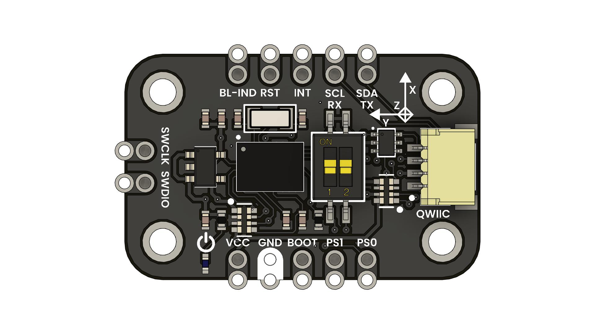

# BNO055 Module

## Introduction
The **BNO055** is a 9-axis absolute orientation sensor from Bosch (accelerometer + gyroscope + magnetometer) with on-board sensor fusion. This breakout makes it easy to integrate, offering:
- A Qwiic-compatible connector for **I²C** at up to 400 kHz  
- Standard 2.54 mm header breakouts  
- A DIP-switch to select **I²C** or **UART** mode  
- SWD pads for programming/debugging  
- Boot indicator LED and pins for **RESET**, **BOOT** and **INT**  

  
  
UNIT BNO055 Module

---

## Key Features
- **9-axis fusion**: accelerometer, gyro, magnetometer with internal fusion algorithms  
- Output formats: Euler angles, quaternions, linear acceleration, raw sensor data  
- Accelerometer range: ±2 g … ±16 g  
  
- Gyroscope range: ±125 °/s … ±2000 °/s  
- Magnetometer range: ±1300 µT  
- **I²C** interface up to 400 kHz  
- **UART** interface up to 115 200 bps  
- Qwiic 4-pin connector (3.3 V)  
- SWD pads for on-board debugging/programming  
- DIP-switch for bus mode and address selection  

---

## Typical Applications
- **Drones / UAVs**: attitude and stabilization control  
  
- **Robotics**: navigation, arm orientation, balancing  
- **VR / AR**: head-tracking and motion sensing  
- **Wearables**: activity and gesture detection  
- **Camera Gimbals**: smooth stabilization  
- **Educational Projects**: sensor-fusion demonstrations  

