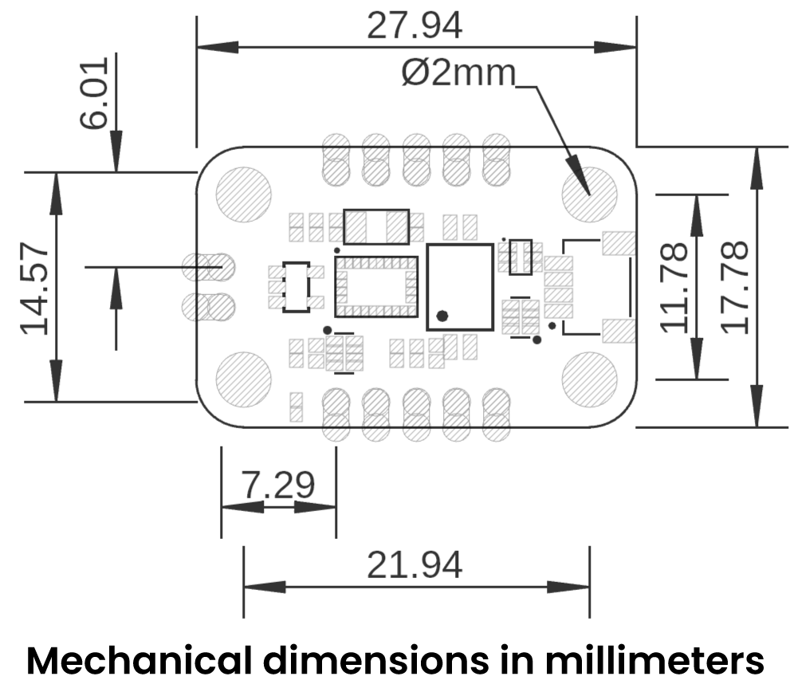
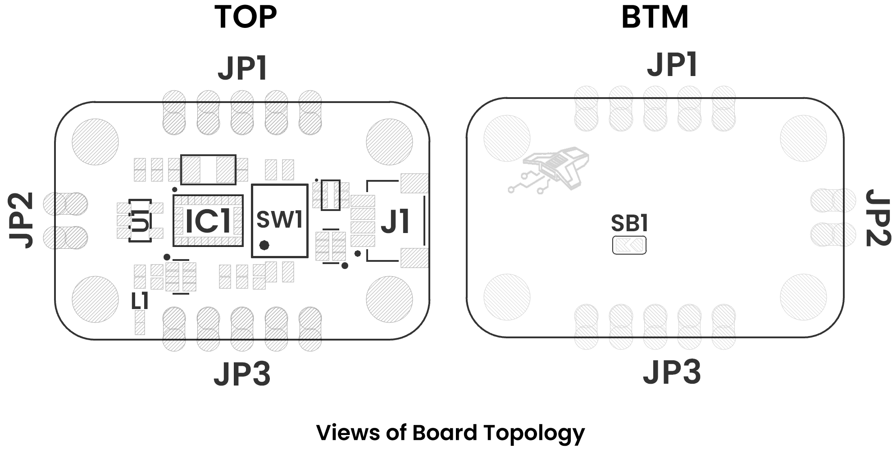

# **Schematic**

  
  
Schematic

# **Pinout**

  
  
Pinout

### Qwiic Connector (SparkFun)

| Pin | Signal  |
|:---:|:--------|
| 1   | **VCC** (3.3 V) |
| 2   | **GND**         |
| 3   | **SDA**         |
| 4   | **SCL**         |

> **Note:** Qwiic operates at 3.3 V only.

| Pin       | Signal               | Description                                          |
|:---------:|:--------------------:|:-----------------------------------------------------|
| VCC       | Power                | 3.3 V                                                |
| GND       | Ground               | 0 V reference                                        |
| BOOT      | Boot Mode            | H = internal bootloader, L = normal application      |
| PS1       | Strap bit 1          | Interface/address selection (see DIP-switch table)   |
| PS0       | Strap bit 0          | Interface/address selection                          |
| BL-IND    | Boot LED             | Blinks in bootloader; power-on indicator             |
| RST       | Reset (active low)   | Hold low to reset the BNO055                         |
| INT       | Interrupt            | “Data ready” or other configurable interrupt output  |
| SCL ↔ RX  | I²C SCL or UART RX   | Depends on PS1/PS0 setting                           |
| SDA ↔ TX  | I²C SDA or UART TX   | Depends on PS1/PS0 setting                           |
| SWCLK     | SWD Clock            | Debug/program via Serial Wire Debug                  |
| SWDIO     | SWD Data             | Debug/program via Serial Wire Debug                  |

---

## **DIP-Switch: Interface & Address Selection**
 

---

# **Dimensions**

  
  
Dimensions

---

# **Topology**

  
  
Topology

| Ref.  | Description                                                                 |
|-------|-----------------------------------------------------------------------------|
| IC1   | BNO055                                                                      |
| U1    | AP2112K 3.3V LDO voltage regulator                                          |
| L1    | Power-on LED                                                                |
| SW1   | Dip Switch for mode selection                                               |
| SB1   | Solder bridge to select I²C address                                         |
| J1    | Low-power I²C QWIIC JST connector                                           |
| JP1   | 2.54 mm pin header                                                          |
| JP2   | 2.54 mm pin header                                                          |
| JP3   | 2.54 mm pin header                                                          |